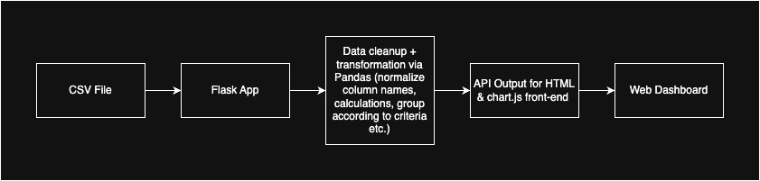

# Analytics Dashboard

This project is a dynamic dashboard that shows the CO2 emissions created by airplanes for each European country. The Flask app is deployed via AWS App Runner and uses a locally processed CSV dataset. Amazon Quicksight analytics was attempted to be implemented but was unsuccessful due to limited AWS permissions. 

[Link to dashboard](https://z9vrppevpm.us-east-1.awsapprunner.com/)
[Dataset Source](https://ansperformance.eu/csv/)

### Data Flow


### User Guide
To run this program locally, run the following commands and you will be able to access the dashboard at http://localhost:8080:
```
pip install -r requirements.txt
python app.py
```
If accessing the dashboard through the web app, refer to the link above. Once you get to the web version, you can hover over each bar to see the respective countries' CO2 emissions. The latency of the data can also be tracked via printed logs. 

### Example
Below is an example of the API output that is used to build the chart on the dashboard. 
```
GET /api/data
[
  {
    "STATE_NAME": "Germany",
    "CO2_QTY_TONNES": 12045.5,
    "TF": 500,
    "CO2_PER_FLIGHT": 24.09
  }
]
```